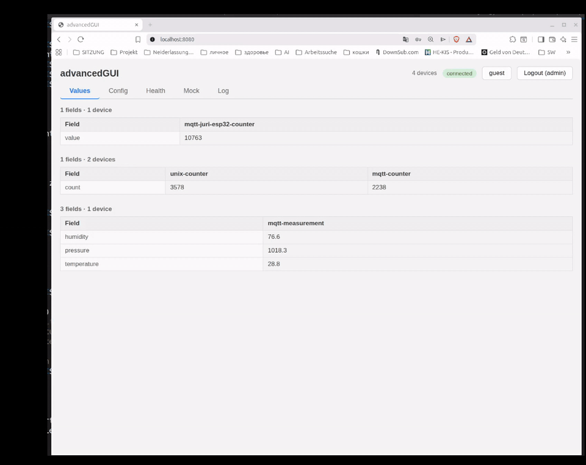

## Table of Contents

- [Prerequisites](#prerequisites)
- [Quick Start](#quick-start)
  - [Option A — Docker](#option-a--docker-recommended-no-nodejs-needed)
  - [Option B — Direct](#option-b--direct-requires-nodejs)
- [Adding a real MQTT device](#Adding-a-real-mqtt-device)
- [Adding a real Unix-socket device](#Adding-a-real-unix-socket-device)
- [Additional Resources](#additional-resources)

## Prerequisites

Choose **one** of the following:

- **Option A (Docker):** Docker installed on your system
- **Option B (direct):** Node.js 18+ and npm 9+

## Quick Start

### Option A — Docker (recommended, no Node.js needed)

```bash
# 1. Clone
git clone <repo-url>
cd p9-advancedGUI/advancedGUI

# 2. Build the image (first time only, or after code changes)
docker build -t advancedgui .

# 3. Start the container
docker run -d -p 8080:8080 --init advancedgui

# With custom MQTT broker port (for external device connections):
docker run -d -p 8080:8080 -p 1883:1883 -e MQTT_BROKER_PORT=1883 --init advancedgui

# 4. Open in browser
# http://localhost:8080
```

### Option B — Direct (requires Node.js)

```bash
# 1. Clone
git clone <repo-url>
cd p9-advancedGUI/advancedGUI

# 2. Install dependencies
npm install

# 3. Start the server
npm start

# 4. Open in browser
# http://localhost:8080
```

Set a custom HTTP port:
```bash
PORT=3000 npm start
```

Set a fixed MQTT broker port (for connecting external devices):
```bash
MQTT_BROKER_PORT=1883 npm start
```
If `MQTT_BROKER_PORT` is not set, the broker picks a random free port (shown in startup log: `Broker started on port XXXXX`).

---

## Adding a real MQTT device

**Zero code changes.** The Aedes broker is already running. Any MQTT client that connects and publishes to any topic will be auto-discovered by `mqtt-scanner.ts` (subscribes to `#`, all topics). Just connect your real device to the broker and publish JSON payloads.

> **Note:** By default the broker uses a **dynamic port** (0). For external devices (ESP32, etc.) you must set `MQTT_BROKER_PORT` in `.env` to a fixed value, e.g. `MQTT_BROKER_PORT=1883`, then configure your device to connect to `<server-ip>:1883`.

---

## Adding a real Unix-socket device

**Zero code changes.** Place a `.sock` file in `UNIX_SOCKET_DIR` (`/tmp/sockets` by default). The `unix-scanner.ts` will:

1. Detect the new `.sock` file → emit `joined` event
2. Connect to it, send `"state?"` → expect a JSON response
3. Forward parsed data to the frontend

Your real device just needs to listen on a Unix socket and respond to `"state?"` with a JSON line.

---

## Additional Resources

- [Watch the Demo Video](https://youtu.be/E_wbnTX-S38)
- [Adding a New Device Protocol](documentation/AddingNewDeviceProtocol.md)
- [Technical Architecture](documentation/technicalDescription.md)
