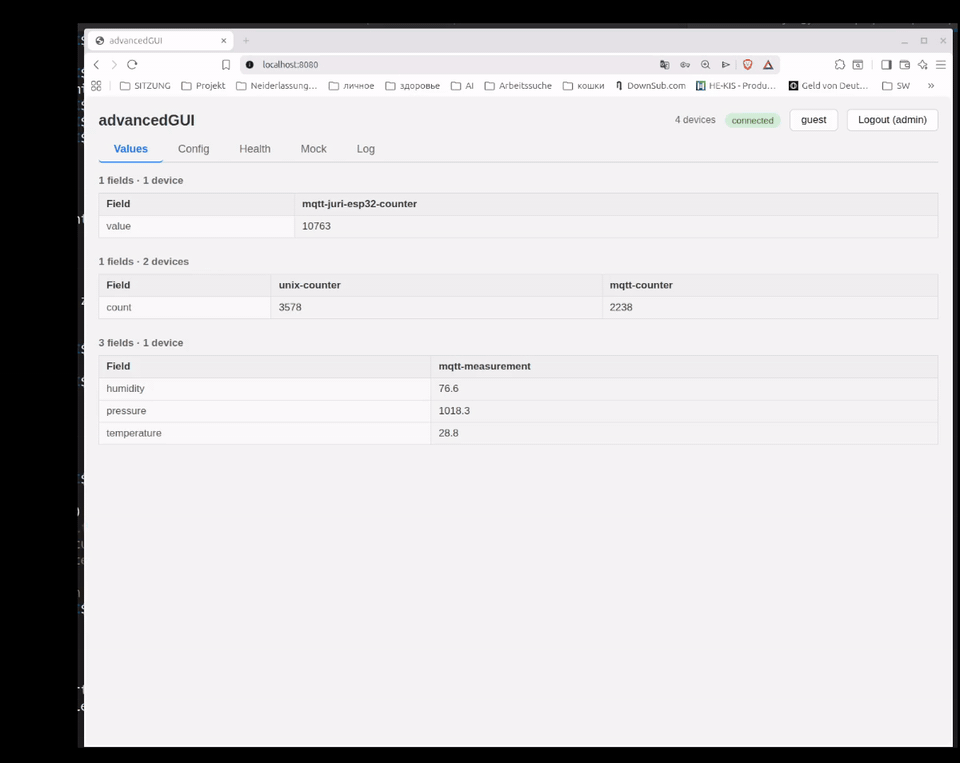

# AdvancedGUI

> Plug-and-play monitoring platform
> for multi-protocol IOT devices.

Embedded devices in industrial environments communicate via different protocols — MQTT sensors, Unix socket controllers, serial buses. Currently, operators need separate tools for each protocol. There is no unified real-time view, no role-based access, and adding a new device type requires custom software.

**AdvancedGUI solves this: one dashboard, all devices, zero code changes for new integrations.**

---

## Key Features

- **Real-time monitoring** — live device data via WebSocket, no polling delay
- **Multi-protocol** — MQTT and Unix sockets today
- **Clean Architecture's port interface** - adding new transports (serial, CAN, etc.) straightforward — implement one interface, wire it in `main/index.ts`
- **Zero-code device integration** — auto-discovery for MQTT (subscribe to `#`) and Unix sockets (poll `.sock` directory)
- **Role-based access** — guest, viewer, operator, admin with per-tab permissions
- **Dynamic pivot table** — fields as rows, devices as columns, configurable field selection with localStorage persistence
- **Production-ready** — health endpoint, graceful shutdown, Docker support, structured logging (pino)

---

## Why It Matters

The role-based access system demonstrates that the platform serves different users differently:

| Username | Password | Level | Access |
|----------|----------|-------|--------|
| — | — | guest | Values only |
| `viewer` | `viewer` | viewer | Values + Config |
| `operator` | `operator` | operator | + Log |
| `admin` | `admin` | admin | + Health + Mock |

This is not just a data viewer — it's an administration platform where operators can monitor, configure, and manage devices through a single interface.



[The same demo with sound](https://youtu.be/E_wbnTX-S38)

---

## Architecture Overview

```
Mock Device ──MQTT──► Aedes Broker ──MQTT──► MQTT Scanner ──callback──► Bridge ──WS──► Browser
                   ┌─────────────┐
Unix Mock ────────►│ Unix Socket │──► Unix Scanner ──callback──► Bridge ──WS──► Browser
                   └─────────────┘
```

| Layer | Purpose |
|---|---|
| **Core** | Pure domain logic — device lifecycle, auth permissions, data flattening, health model. Zero external dependencies. |
| **Ports** | Interface contracts (DeviceScanner, UserStore, Logger, Connector) — separate core from infrastructure |
| **Adapters** | Infrastructure implementations — MQTT/Unix scanners, WebSocket bridge, Express server, file-based user store |
| **Frontend** | Plain HTML/CSS/JS — no build step, WebSocket API, pivot-table layout |

Full architecture documentation → [component-diagram.md](documentation/component-diagram.md)

---

## Tech Stack

| Category | Technology |
|---|---|
| Language | TypeScript (backend), JavaScript (frontend) |
| Runtime | Node.js 18+ / TSX |
| Protocols | MQTT (Aedes embedded broker), Unix sockets, WebSocket, HTTP |
| Framework | Express.js (HTTP), ws (WebSocket) |
| Logging | pino |
| Testing | Vitest (35 tests: domain, infrastructure, e2e) |
| Deployment | Docker (Alpine Linux) |
| Architecture | Hexagonal (Clean Architecture) |

---

## Quick Start

Run with Docker or Node.js in under a minute:

```bash
# Docker
docker build -t advancedgui . && docker run -d -p 8080:8080 --init advancedgui

# Node.js
npm install && npm start
```

Open `http://localhost:8080`. No login required for basic device monitoring.

→ [Full setup guide, Docker options, and device integration](documentation/GettingStarted.md)

---

## Adding Real Devices

Zero code changes — the platform auto-discovers MQTT devices and Unix socket devices.

→ [GettingStarted.md](documentation/GettingStarted.md) for connection details,
[AddingNewDeviceProtocol.md](documentation/AddingNewDeviceProtocol.md) for new protocols (serial, CAN, etc.)

---

## Testing

| Type | Count | What |
|---|---|---|
| Domain tests | 15 | Pure logic — auth, device lifecycle, flatten, health |
| Infrastructure tests | 16 | Adapters — MQTT broker, Unix sockets, WS, HTTP, file I/O |
| E2E tests | 4 | Full stack — page serving, auth, health, WS with auth |

Run: `npm test`

---

## Documentation

| Document | Description |
|---|---|
| [Getting Started](documentation/GettingStarted.md) | Setup, Docker, device integration, configuration |
| [Technical Decisions](documentation/technicalDescription.md) | Architecture, core, infrastructure, UI, test strategy |
| [Component Diagram](documentation/component-diagram.md) | Detailed ASCII component diagram |
| [Clean Architecture](documentation/clean-architecture-layers.md) | Layered architecture [diagram](documentation/images/clean-architecture-layers.png) |
| [Adding New Devices](documentation/AddingNewDeviceProtocol.md) | Guide for new protocols (serial, CAN, etc.) |
| [Configurable Parameters](documentation/configurableParameters.md) | Environment variables and configuration |
