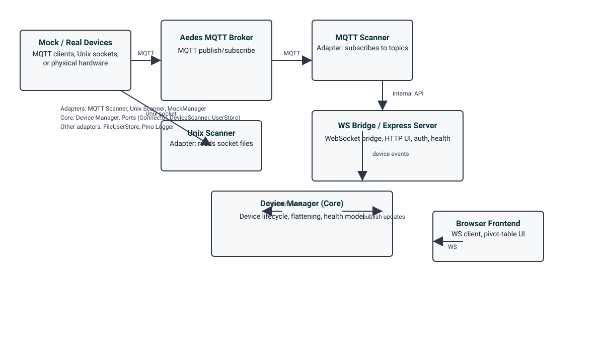

# advancedGUI — Architecture

This directory contains a rendered architecture diagram for the advancedGUI project.

The diagram shows the main runtime components and adapters:

- Mock / Real Devices: MQTT clients or Unix socket emulators (or physical hardware)
- Aedes MQTT Broker: local broker used for MQTT messaging
- MQTT Scanner and Unix Scanner: adapters that convert transport data into the core device model
- WS Bridge / Express Server: serves the frontend, handles auth and health, and exposes a WebSocket bridge
- Device Manager (core): device lifecycle, data flattening and health model (no external deps)
- Browser Frontend: WebSocket client that renders UI (pivot tables, logs, config)

Additional adapters: File-based UserStore, Pino logger, MockManager (controls simulated devices)
